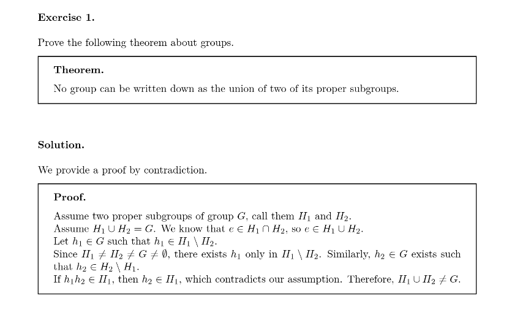

# KNED
K.N. Toosi University of Technology Exercise Document.



## How to use

clone the repo then copy the repo in the following path:

```sh
cp -r KNED $TEXMFHOME/tex/latex/
```
### Template 
In your LaTeX code you can use it as follow:
Use the KNED documentclass ( defined in KNED.cls).
```latex
\documentclass[option]{KNED}
```
options as of now are: english, persian.
the default option is english.
what the options do is basically they change the language of the
environment names.
e.g "تمرین" for the persian option and "Exercise" for the english one.

to set your own headers put the following codes after document class inclusion:

```latex
\renewcommand{\KNEDRHdr}{Right Header}
\renewcommand{\KNEDLHdr}{Left Header}
```

## Environments
There are several environments listed below:
- `exercise`
- `solution`
- `theorem`
- `proof`
- `corollary`
- `remark`
- `example`

you can use them as follows:

### Exercise
Here is an example usage:
```latex
\begin{exercise}[EXERCISE TITLE]
Exercise Content goes here.
\end{exercise}
```
You can reference the exercise number within the document using `\ref{}` and `\label{}` as usual. For example, `\ref{exercise_label}` would refer to the exercise labeled with `\label{exercise_label}`.

### Solution
Here is an example usage:
```latex
\begin{solution}
Answer goes here.
\end{solution}
```
### Proof
Here is an example usage:
```latex
\begin{proof}
Proof goes here.
\end{proof}
```
## TODO

- [x] Create Example with environment and logo.
- [x] Added Persian and English options.
- [x] Add more Environments (Proof, Lemma, etc...)
- [x] Add Environment compatibility for Persian text (XePersian), Persian exercise and solution title.
- [ ] Test against Persian support in different latex set ups.
- [ ] Add dependency list.
